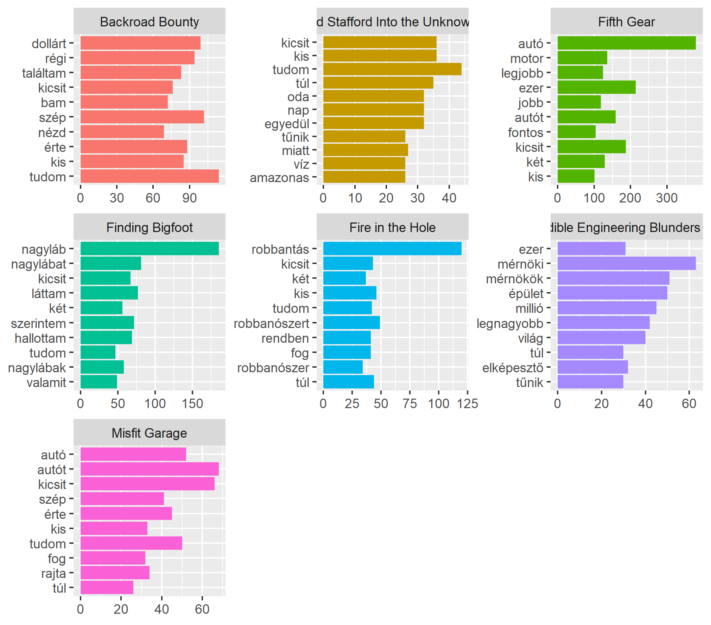
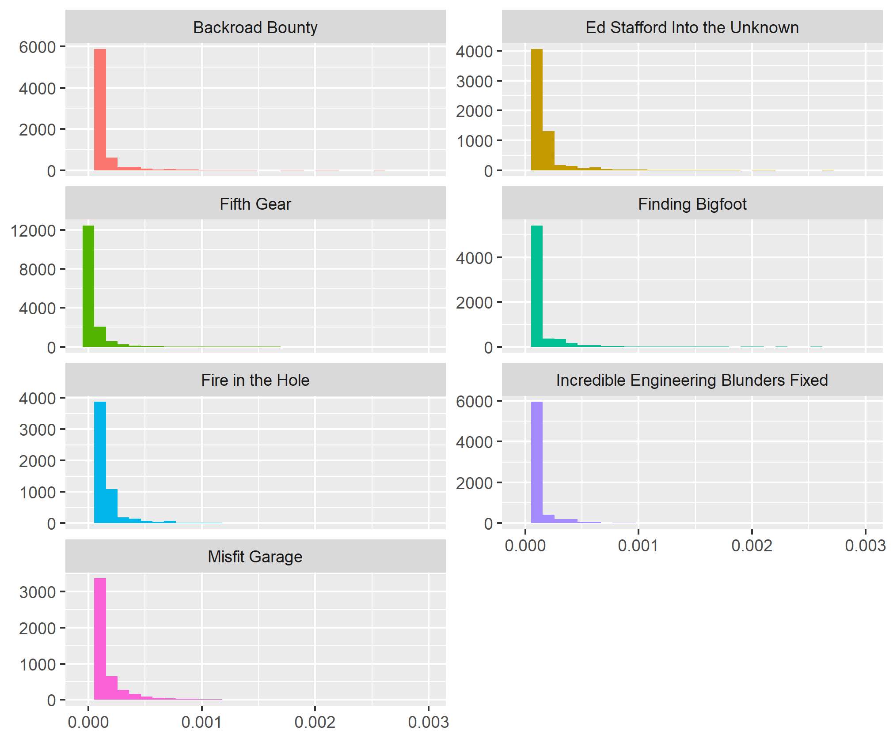

# Text and sentiment analysis of Hungarian scripts
Term Project for *Data Science 4: Unstructured Text Analysis* at CEU, Budapest. It leverages the outputs of the [dubbR package](https://github.com/szigony/dubbR) that I created for this specific use-case.

#### Table of contents

- [Goal of the analysis](#goal-of-the-analysis)
- [About the data](#about-the-data)
- [About the package](#about-the-package)
- [Term frequency analysis](#term-frequency-analysis)
  - [Exploration](#exploration)
  - [Relative term frequency](#relative-term-frequency)
  - [Tf-idf](#tf-idf)
- [Sentiment analysis](#sentiment-analysis)
- [Summary](#summary)
- [Recommendations](#recommendations)

## Goal of the analysis

The goal of this analysis is to see how well the topics of certain scripts written for the Hungarian Discovery Channel can be used to identify the contents of a show. Would it be possible for a tech-savvy intern at one of the production companies to "take the lazy way" and write the synopsis for certain episodes merely based on term frequency analysis? I'm also looking into the Hungarian Sentiment Lexicon created by Szabó (2014) to see if it can be used to perform meaningful text analysis. Can we determine based on the scripts whether for example the outcome of a car test is positive or negative? These are the questions I'm attempting to answer.

## About the data

Between August 2014 and February 2016 I worked for Mafilm Audio as an audiovisual translator, writing Hungarian dubs for TV shows that aired on Discovery Channel or one of its sister channels (TLC, Animal Planet etc.). Little did I know back then, but the seemingly strict formal requirements came in handy when looking for a project for a course at CEU.

I had written exactly 100 scripts, all with the same format - timestamp, character and text within several tables per script. For this excercise, I ended up using 52 scripts from 7 TV shows with different topics:

- **Backroad Bounty:** Two guys looking for treasure in other people's junk, bidding on various items.
- **Ed Stafford Into the Unknown:** Ed Stafford wandering around the globe, looking for mysterious places and adventures.
- **Fifth Gear:** Your tipical motor magazine with car tests.
- **Finding Bigfoot:** A team in search of the mysterious creature called Bigfoot.
- **Fire in the Hole:** An explosives expert... blowing stuff up.
- **Incredible Engineering Blunders Fixed:** Looking for engineering "miracles" in the worst possible sense of the word.
- **Misfit Garage:** Pimp My Ride style garage with lots of rivalry.

## About the package

I created the [dubbR package](https://github.com/szigony/dubbR) to bring my scripts into a format that's convenient for text analysis - for a more detailed description about functionalities, please visit the aforementioned link.

The package loads all the scripts in their original format with the help of the `read_docx` function from the `docxtractr` package. It dissects the input file names and creates a metadata tibble by utilizing the `str_extract` function with RegEx, as well as the `str_replace` function from the `stringr` package. For ease of identification, it also automatically assigns a `dub_id` for each script. Initially, there are three tibbles created that later serve as inputs for the functions within the package, these are: `dubbr_metadata`, `dubbr_text` and `dubbr_characters`.

**Functions:**

- `dub_shows()` - Returns the list of shows that are available in the package. This can be used to identify which shows we'd like to filter on for the other functions, if we'd like to limit our dataset.
- `dub_metadata()` - Metadata about the audiovisual translations (`dub_id`, `production_code`, `show`, `season` and `episode`).
- `dub_text()` - The text of the scripts with `dub_id` and `text`.
- `dub_characters()` - The characters that appear in the different shows. This can be used for `anti_join`s to remove character names that would disturbe the analysis.

## Term frequency analysis

> **The full code can be found in the [text-analysis.R](text-analysis.R) file.**

- I used the following packages to perform the analysis: `tidytext`, `dplyr`, `stringr`, `ggplot2`, `tidyr` and `scales`, as well as my own `dubbR` package.
  
- In addition to the Hungarian stopwords from the `tidytext` package, I included my custom list with possessives, suffixes and words such as "ha" (*if*), "is" (*too*), "szóval" (*so*), etc.

  ```r
  hu_stopwords <- bind_rows(
    get_stopwords("hu"),
    tibble(
      word = c("is", "ha", "as", "es", "le", "t", "a", "á", "én", "te", "ő", "mi", "ti", "ők", "engem", 
               "téged", "őt", "minket", "titeket", "őket", "oké", "szóval", "se"),
      lexicon = c("custom")
    )
  )
  ```

- Since I'd like to perform analysis on all available shows, I looped through the results of `dub_shows()` and created a `tidy_shows` tibble that leverages `unnest_tokens` on the filtered results of `dub_text()` and gets rid of all the character names by `anti_join`ing the filtered set of `dub_characters()` on `dub_id`. I also removed the stopwords, and joined the filtered `dub_metadata()` set to maintain information about which show and which episode a certain word belonges to. Since cars in Fifth Gear tend to have numbers in their names, I removed these as well.

### Exploration

I started with a simple term frequency for each of the shows to see if it approximates the topics properly.



- Backroad Bounty has words such as "dollárt" (*dollar*), "régi" (*old*) and "találtam" (*I found*), which suggests that it has something to do with antics.
- In case of Into the Unknown, other than Amazonas, nothing suggests what the show's about.
- Fifth Gear has "autó"/"autót" (*car*), and the same goes for Misfit Garage, so we can have some basic idea that it's something about cars.
- The other three shows hit really close to home:
  - For Finding Bigfoot, three versions of "nagyláb" (*Bigfoot*) appear among the most frequent terms, as well as terms refering to the show's supernatural (and highly fictive) nature: "láttam" (*I saw*), "hallottam" (*I heard*) and "valamit" (*something*).
  - Fire in the Hole is all about explosions, and we have the word for explosion and explosives among the top terms.
  - Last but not least, Incredible Engineering Blunders Fixed seems to be related to "mérnöki" (*of engineers*), "mérnökök" (*engineers*) and "épület" (*building*).
  
Okay, it seems like this could potentially help our lazy intern, but what happens when it comes to episodes of a certain show? Let's look at the first four episodes of Fifth Gear! :car:


This seems to help to at least identify what cars appear in an episode.

The first episode seems to have a Range Rover, an Audi and a BMW (all true). In the second episode, the hosts are testing a Megane, a Mazda, a Jaguar and a Toyota and the episode seems to be focused on hatchbacks ("hátsókerék"/"hátsókerekes"). In the third one, next to a McLaren and a Gold, there appears to be some kind of accident as well, judging by the words "ütközés" (collusion) and "sérülés" (injury). And in the fourth episode, we have the Aston Martin Vanquish which is most likely fast ("gyors") and the newest ("legújabb") and the best ("legjobb").

With just a few lines of code, we probably made the intern's life a lot easier. :smile:

### Relative term frequency

Let's look at how similar my vocabulary was in case of Fifth Gear, Finding Bigfoot and Incredible Engineering Blunders Fixed.


Although I re-used the same words lots of times, there's a clear distinction when it comes to topics, as it can be seen on the chart above. In terms of Fifth Gear and IEBF, I used words such as "mérnöki" (*of engineers*), "legnagyobb" (*greatest*) and "elképesztő" (*amazing*) to describe engineering, while I obviously mostly used the word "autó" (*car*) for the show about cars. And hearsay seems to dominate for Finding Bigfoot with "biztosan" (*certainly*) and "láttam" (*I saw*).

### Tf-idf

The term distribution for all shows shows a typical long-tailed distribution - many words occur frequently, and only a few rarely.



Let's look at term and document frequency for all shows.


Now this gives a lot better picture of what the shows are about than our initial analysis, and it could be a lot safer to rely on this when writing summaries.

- **Backroad Bounty:** "bam" is the name of one of the characters (Bam Bam), but other than that we can see references to price ("dollárt", "dollárért"), that something is for sale ("eladó") and that the show is also about junk ("kacatok") and treasures ("kincs").
- **Ed Stafford Into the Unknown:** The words speak for themselves - Amazonas, jungle ("dzsungel"), desert ("sivatag"), aboriginal ("bennszülött").
- **Fifth Gear:** A lot of cars (Audi, BMW, Gold, Porsche, AMG, Renault) and the word "verseny" (*race*) let us have a pretty good understanding about the topic.
- **Finding Bigfoot:** Five appearances of some form of the word Bigfoot ("nagyláb*").
- **Fire in the Hole:** Four mentions of something explosion related ("robbantás", "robbanószert", "robbanószer", "dobbantunk") and some jargon.
- **IEBF:** In addition to engineering related words we can also get some idea about where those blunders occurr: "torony" (*tower*) or "repülőtér" (*airport*) for example.
- **Misfit Garage:** There are some car types, but there also seems to be a lot of mentioning of Gas Monkey, the rivaling garage.

## Sentiment analysis

The [Hungarian Sentiment Lexicon](http://opendata.hu/dataset/hungarian-sentiment-lexicon) from Szabó (2014) contains 7688 words altogether (1748 positive and 5940 negative), which isn't a huge number, but it is still a great collection that can be used to perform some analysis.

Let's look at the sentiment for all shows.


Fire in the Hole and IEBF appear to tend towards the negative, as one is all about dangerous explosions, and the other's about engineering solutions gone wrong, this is sort of what we would expect. Ed Stafford wanders into the unknown which isn't without its risk, but all other shows seem to be positive in general, although at this point we have absolutely no idea why, or even if this assumption is correct.

Let's look at an example. Can we see how the tests generally went throughout the season by the sentiments of Fifth Gear?


This suggests an overall positive attitude all through the season, but unfortunately there are some shortcomings:

- The word "fontos" (*important*) contributes the most to the positive sentiment, however throughout the text it's used more as neutral than positive.
- "Fél" in itself is negative, but it can have two meanings: "half" or "to be afraid". Big difference.
- While most of the words fall into the right bucket, almost all could possibly gain different meaning if we were to look at bigrams. Just one example: "tetszik" means that I like it, while "nem tetszik" would mean that I don't like it.
- "Felfüggesztés" is negative in the sense that it means "suspension", however, since Fifth Gear is a car show, here we're talking about the spare part.

Could sentiment analysis help to predict the outcome of the tests?


Well, somewhat. It's not a huge problem for the intern, because you wouldn't want to spoil the ending, but from an analysis point of view, it's not very deterministic.

- **First episode:** "Tetszik" (I like it) and "luxus" (*luxury*) are on the top of the list, but so is "rossz" (*bad*) and "zavaró" (*disturbing*). Overall the positives seem to outweigh the negatives, but who can confidently say?
- **Second episode:** "Tetszik" and "bad" are the most dominant, same as above, but we can also observe words such as "baj" (problem). This seemingly trends toward the negative.
- **Third episode:** Mixed signals again, although "ütközés" (*collusion*) and "sérülés" (*injury*) are outstanding with regards to their contribution to the sentiment. Amongst the positives, we can see "csodálatos" (*wonderful*), "remek" (*great*), "zseniális" (*brilliant*). The episode does have car crash scenes, but it's all part of a safety endurance test which ends on a positive note. So close, yet so far.
- **Fourth episode:** The last episode in our scope is the only one where we can confidently say that it's positive. The only negative word is "fél", which as I mentioned earlier, can mean both "half" and "to be afraid".

## Summary

## Recommendations
